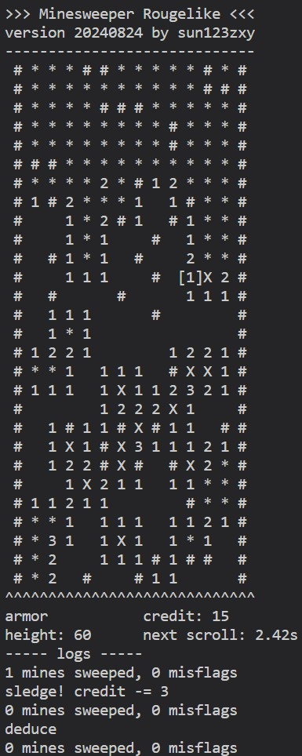

## Minesweeper Roguelike

Sweep out the mines quickly to escape from being left behind! A minesweeper game in console with some roguelike feature. Simple toy project for amusement.

- The map consists of randomly generated bombs, walls and spaces, scrolling down with an increasing speed. You failed on triggering a bomb or being left behind.
- Use `Up`, `Down`, `Left`, `Right` to control the cursor. You can move at most 2 blocks away (in Chebyshev distance) from the revealed area. You can't move through a wall.
- Press `Z` / `Space` / `Enter` to reveal a block, trigger a bomb, or do an auto-inference around a numbered space.
- Press `X` / `F` to flag. You earn credits by flagging correctly (or lose some if otherwise).
- Items cost credits. Press `A`, `S`, `E` to switch beteen different items. Aumor protects you on triggering. Sledge tears down a wall. Eagle reveals a 3 by 3 block safely.

Written and tested under Python 3.12.5 on Windows 11. `numpy` is the only requirement. Execute `msrogue.py` to start. Adjust constants in the code to control difficulty as you wish.

Executables are packed via `pyinstaller -F msrogue.py`. You may prefer to a create a virtual environment before packing. `numpy` with `mkl` may produce executables of hundreds of MBs. Install `blas` before `numpy` to avoid such.